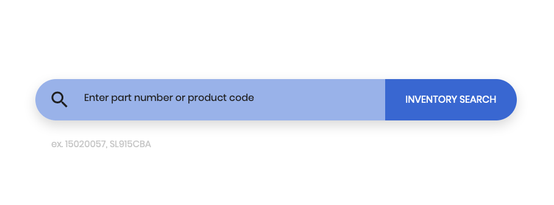
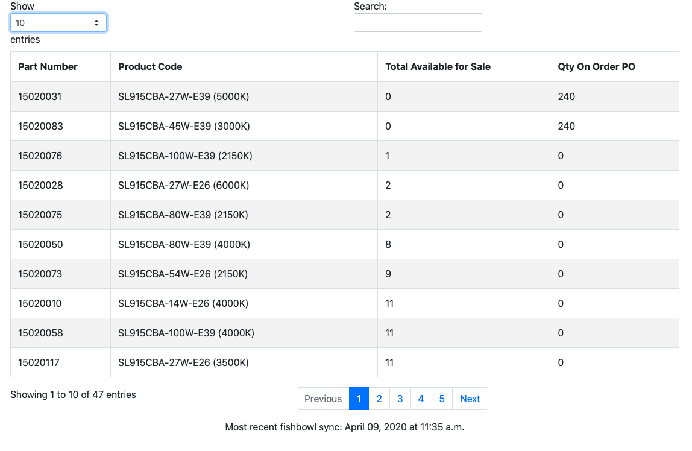

# fast-inventory - Web Reporting Tool for SLC

Simple, accurate, and easily accessible inventory levels for sales staff. Designed for mobile field use.

## Table of contents
* [General Info](#general-info)
* [Technologies](#technologies)
* [Setup](#setup)

## General info

This project works with an inventory flat file that is outputted from the ERP system, which is inserted into a PostgreSQL database every 5 minutes.  That python script is found under the inventorywebtool directory. SQL files for the PostgreSQL database are found under the sql directory.

## Technologies
Project is created with:
* Python 3.7.7
* Flask 1.1.1
* Bootstrap 4
* PostgreSQL 12

## Usage

## :gear: Setup your own
Clone this repo and install packages from the requirements.txt file.  Paths will have to be changed to reflect your flat file location.

